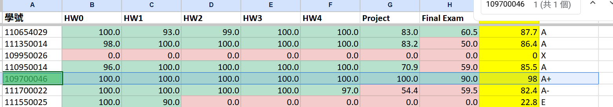

# Introduction to Artificial Intelligence - Academic Portfolio


[](https://github.com)
[](https://github.com)
[](https://github.com)
[](https://python.org)
[](https://scikit-learn.org)
[](https://opencv.org)
[](https://github.com)



This repository showcases my exceptional performance in **NYCU CS Introduction to Artificial Intelligence**, demonstrating advanced proficiency in machine learning, computer vision, natural language processing, and reinforcement learning. Achieved perfect scores (100/100) on all homework assignments (HW0-HW4), reflecting my ability to implement complex AI algorithms from scratch and apply state-of-the-art techniques to real-world problems.

## 🏆 Key Achievements & Technical Skills

### **HW0 – Python & Computer Vision Fundamentals**
- **Technologies**: Python 3.8+, OpenCV, PIL
- **Implementation**: Advanced image processing pipeline with bounding box detection, frame differencing for video analysis, and comprehensive image transformations
- **Skills Demonstrated**: Object-oriented programming, computer vision algorithms, image manipulation

### **HW1 – Machine Learning & Object Detection** 
- **Technologies**: scikit-learn, NumPy, YOLOv7
- **Implementation**: Multi-algorithm comparison for parking lot occupancy detection using KNN, Random Forest, and AdaBoost classifiers
- **Advanced Features**: Custom dataset loader, detection pipeline optimization, and modern deep learning integration with YOLOv7
- **Skills Demonstrated**: Classical ML algorithms, ensemble methods, deep learning frameworks, performance evaluation

### **HW2 – Natural Language Processing & Deep Learning**
- **Technologies**: PyTorch, Transformers, BERT, RNN architectures
- **Implementation**: Comprehensive sentiment analysis system with three distinct approaches:
  - N-gram statistical language modeling
  - Custom RNN implementation from scratch
  - Fine-tuned DistilBERT transformer model
- **Skills Demonstrated**: NLP preprocessing, neural network design, transfer learning, model comparison and evaluation

### **HW3 – Reinforcement Learning & Multi-Agent Systems**
- **Technologies**: Python, PyTorch, Custom RL Environment
- **Implementation**: Advanced RL agents for Pacman game environment:
  - Value iteration algorithm
  - Q-learning with experience replay
  - Multi-agent search strategies
  - Deep Q-Networks (DQN) with pre-trained policy and target networks
- **Skills Demonstrated**: Dynamic programming, temporal difference learning, neural network training, game AI

### **HW4 – Research & Analysis**
- **Deliverable**: Comprehensive technical report analyzing experimental results, algorithmic performance comparisons, and insights gained from practical AI implementation
- **Skills Demonstrated**: Technical writing, experimental design, data analysis, critical thinking

## 🛠 Technical Stack

- **Languages**: Python 3.8+
- **ML/DL Frameworks**: PyTorch, scikit-learn, Transformers
- **Computer Vision**: OpenCV, PIL
- **Data Science**: NumPy, Pandas, Matplotlib
- **Deep Learning**: BERT, RNN, CNN, DQN architectures
- **Development Tools**: Jupyter Notebooks, Git

## 🚀 Getting Started

All projects are implemented in Python 3.8+ with comprehensive documentation. To validate the codebase:

```bash
python -m py_compile $(git ls-files '*.py')
```

Each homework directory contains:
- Complete source code implementations
- Detailed PDF reports with experimental results
- Pre-trained models where applicable
- Comprehensive documentation and usage instructions

## 📊 Academic Impact

This coursework demonstrates my ability to:
- Implement complex AI algorithms from theoretical foundations
- Compare and evaluate multiple approaches to the same problem
- Apply cutting-edge techniques (BERT, YOLOv7, DQN) effectively  
- Write clean, well-documented, and maintainable code
- Analyze and communicate technical results clearly

## 🙏 Acknowledgements

Built upon course materials from NYCU CS Department and UC Berkeley AI Research Group, enhanced with modern deep learning implementations and comprehensive experimental analysis.
